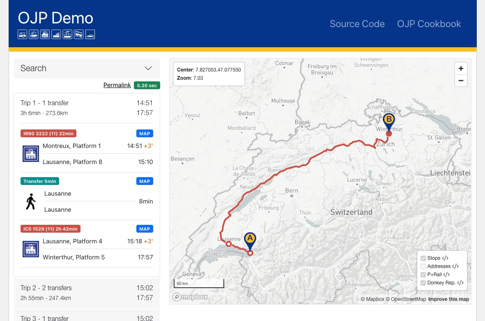

# ojp-demo-app-src

Source-code repo for https://opentdatach.github.io/ojp-demo-app/

See [docs/URLs](./docs/URLs.md) for application URL scheme parameters.

## Development server

This project was generated with [Angular CLI](https://github.com/angular/angular-cli) version 11.2.12.

Run `ng serve` for a dev server. Navigate to `http://localhost:4200/`. The app will automatically reload if you change any of the source files.

## Deploy to production

We are using [Github Pages](https://pages.github.com/) to publish and host the OJP Demo app.

Run `ng deploy` to deploy the app. The script will bundle the app files and assets in production mode and upload them to `gh-pages` branch of https://github.com/openTdataCH/ojp-demo-app .

The app is available under https://opentdatach.github.io/ojp-demo-app/

See [CHANGELOG](./CHANGELOG.md) for deployment changes.

## License

The project is released under a [MIT license](./LICENSE.txt).

Copyright (c) 2021 Open Data Platform Mobility Switzerland - [opentransportdata.swiss](https://opentransportdata.swiss/en/).