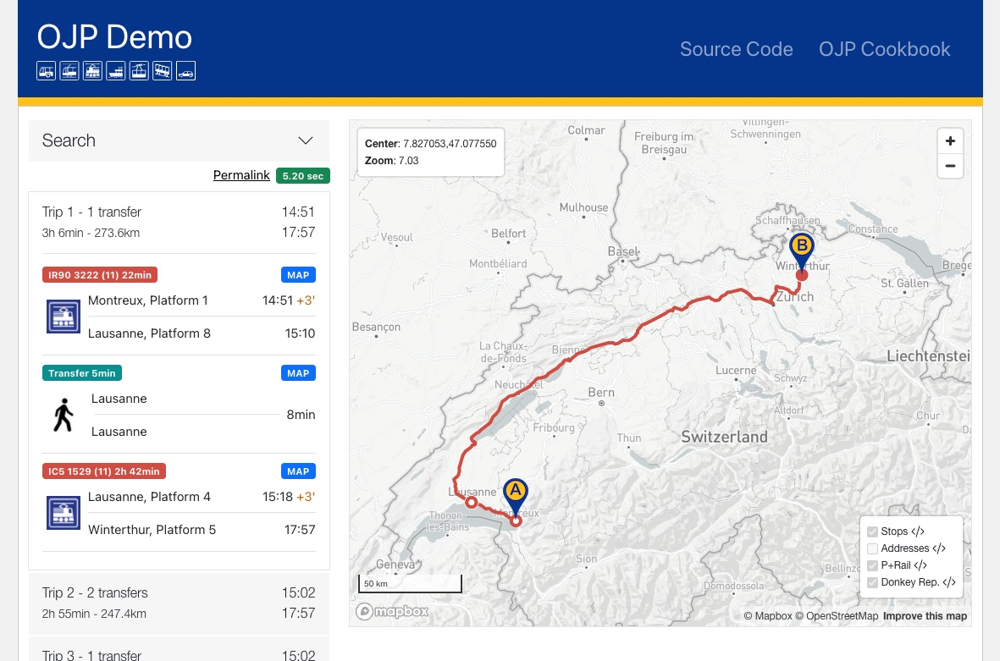

# OJP Demo App

This is the source-code repository used for developing and deploying [OJP Demo](https://opentdatach.github.io/ojp-demo-app/) web-application.



## Quick Resources

- https://opentdatach.github.io/ojp-demo-app/ - production URL
- [CHANGELOG](./CHANGELOG.md) - deployment changes
- [Architecture](./docs/architecture.md)
- [App Features](./docs/features.md)
- [Query Params Examples](./docs/URLs.md)

## Current Development Status

Javascript SDK branches

| Branch | NPM | Demo App | Description |
|-|-|-|-|
| [ojp-js#ojp-sdk-legacy](https://github.com/openTdataCH/ojp-js/tree/feature/ojp-sdk-legacy) | [ojp-sdk-legacy](https://www.npmjs.com/package/ojp-sdk-legacy) | <ul><li>[PROD](https://opentdatach.github.io/ojp-demo-app/search)</li><li>[BETA v1](https://tools.odpch.ch/beta-ojp-demo/search)</li><li>[BETA v2](https://tools.odpch.ch/ojp-demo-v2/search)</li></ul> | original SDK, contains dual code for OJP `1.0`,`2.0` |
| [ojp-js#ojp-sdk-next](https://github.com/openTdataCH/ojp-js/tree/feature/ojp-sdk-next) | [ojp-sdk-next](https://www.npmjs.com/package/ojp-sdk-next) - temporarely, long-term will be published under `ojp-sdk` | under development | new SDK code with models derived from XSD schema, this will be the main development reference for OJP JS SDK |

Code / Demo App Implementation

| Code Place | LIR | SER | TR | TIR | FR | TRR | Comments |
| - | - | - | - | - | - | - | - |
| `ojp-sdk-legacy` (legacy SDK) | :white_check_mark: | :white_check_mark: | :white_check_mark: | - | - | - | TRR is only available for OJP v2.0 |
| `ojp-sdk-next` (new SDK) | :white_check_mark: | :white_check_mark: | :white_check_mark: | :white_check_mark: | :white_check_mark: | :white_check_mark: |  |
| DemoApp Beta | `legacy` | `legacy` | `legacy` | `ojp-sdk-next` | `ojp-sdk-next` | `ojp-sdk-next` | `legacy` is the old SDK (OJP v1 and v2, see above) |

- LIR - LocationInformationRequest
- SER - StopEventRequest
- TR - TripRequest
- TIR - TripInfoRequest
- FR - FareRequest
- TRR - TripRefineRequest

## Install & Development server

Requirements:
- [Node.js](https://nodejs.org/en/), [npm](https://www.npmjs.com/)
- [Angular](https://angular.io/guide/setup-local#install-the-angular-cli), version 14.x was used to generate this project via `ng new` CLI command.

Installation steps:
- clone this repo
- install dependencies via npm
```
npm install
```

- copy `src/app/config/app-config.ts` to `src/app/config/app-config.local.ts` 

- get an OJP 2.0 (or 1.0) key from https://api-manager.opentransportdata.swiss/

- replace the key placeholder
```
# src/app/config/app-config.local.ts

...

// OJP 2.0
'V2-PROD': {
    url: 'https://api.opentransportdata.swiss/ojp20',
    authToken: 'PLACEHOLDER_REPLACE__PROD',
},

...
```

- serve local development server
```
ng serve
```

- navigate to [http://localhost:4200](http://localhost:4200/) in the browser

## License

The project is released under a [MIT license](./LICENSE.txt).

Copyright (c) 2021 - 2025 Open Data Platform Mobility Switzerland - [opentransportdata.swiss](https://opentransportdata.swiss/en/).