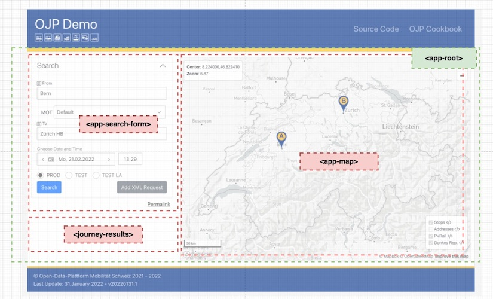
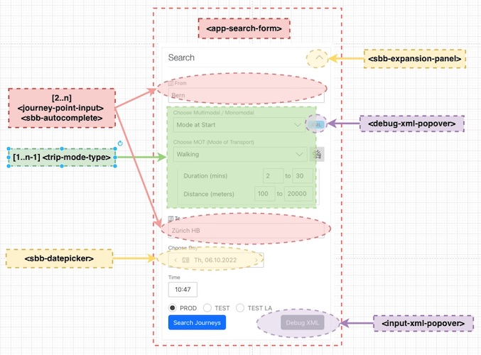
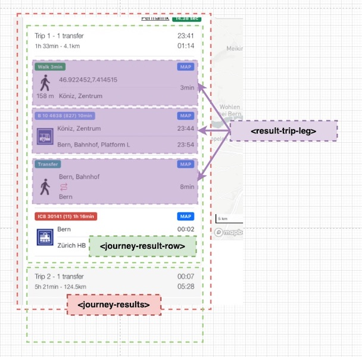

# OJP Demo Components

- [\<app-root\>](./../src/app/app.component.ts) - entry point container
    - [\<app-search-form\>](./../src/app/search-form/search-form.component.ts) - search form (left-side) - Bootstrap grid `col-4`
    - [\<journey-results\>](./../src/app/journey/journey-results/journey-results.component.ts) - journeys results (under search results, hidden by default)
    - [\<app-map\>](./../src/app/map/map.component.ts) - map component (right-side) - Bootstrap grid `col-8`

- [\<app-search-form\>](./../src/app/search-form/search-form.component.ts) - search form with [SbbAccordionModule](https://angular-v12.app.sbb.ch/business/components/accordion) as a colapsible wrapper
    - [\<journey-point-input\>](./../src/app/search-form/journey-point-input/) + [SbbAutocompleteModule](https://angular-v12.app.sbb.ch/business/components/autocomplete) - for the journey search fields (from, to, via) with autcomple (type-ahead) support
    - [\<trip-mot-type\>](./../src/app/search-form/trip-mot-type/) - for rendering the mode of transport (MOT) selector of the journey legs
    - [\<debug-xml-popover>](./../src/app/search-form/debug-xml-popover/) + [SbbDialogModule](https://angular-v12.app.sbb.ch/business/components/dialog) - to display modal windows showing request and response XML from OJP APIs
    - [\<input-xml-popover>](./../src/app/search-form/input-xml-popover/) + [SbbDialogModule](https://angular-v12.app.sbb.ch/business/components/dialog) - to debug custom [OJPTripRequest](https://opentransportdata.swiss/en/cookbook/ojptriprequest/) request and responses

- [\<journey-results\>](./../src/app/journey/journey-results/) - journeys list embedded in a [SbbAccordionModule](https://angular-v12.app.sbb.ch/business/components/accordion) colapsible wrapper
    - [\<journey-result-row\>](./../src/app/journey/journey-result-row/) - for each individual journey
        - [\<journey-result-row\>](./../src/app/journey/journey-result-row/result-trip-leg/) - for each individual leg which is a mono-modal segment (walk, transfer, public transport, shared mobility, etc.)

See also
- [Architecture](./architecture.md)
- [Project Structure](./project_structure.md)

----

CHANGELOG
- Feb 2022 - created this document