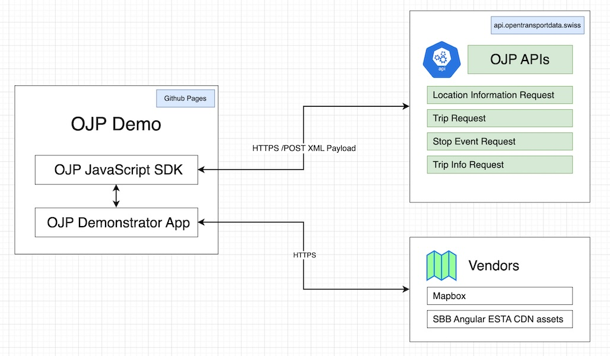
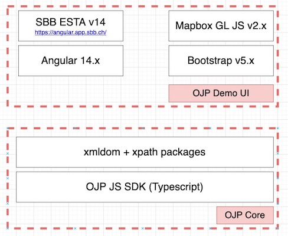

# Architecture

OJP Demo is a [TypeScript](https://www.typescriptlang.org/) web application, composed of the following:
- OJP JavaScript SDK - available in a [separate repo](https://github.com/openTdataCH/ojp-js) and as a [npm package](https://www.npmjs.com/package/ojp-sdk) - the main responsability is to comunicate with [OJP APIs](https://opentransportdata.swiss/en/cookbook/open-journey-planner-ojp/). Following OSS libraries are used for querying and parsing the XML response:
  - [xmldom](https://github.com/jindw/xmldom) - JavaScript implementation of W3C DOM for Node.js
  - [xpath](https://github.com/goto100/xpath) - DOM3 XPath 1.0 implemention for JavaScript
- OJP Demo App - this component is using [Angular](https://angular.io/) web-framework components and services for UI rendering. Following additional libraries are used: 
  - [Mapbox GL JS](https://docs.mapbox.com/mapbox-gl-js/api/) - client-side JavaScript library for building web maps
  - [SBB Angular v.14](https://angular.app.sbb.ch/) - OSS component library from SBB for UI elements like autocomplete, date pickers, etc.
  - [Bootstrap](https://getbootstrap.com/) - OSS web framework for final HTML / CSS appearance

See also
- [App Components](./app_components.md)

----

CHANGELOG
- Nov 2022 - updated OJP SDK
- Oct 2022 - updated with StopEvent
- Feb 2022 - created this document