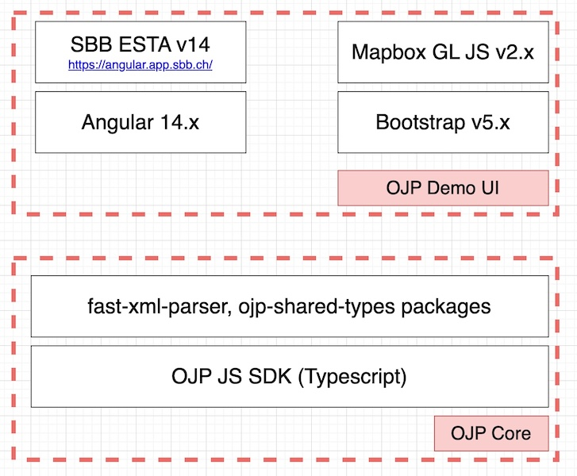

# Architecture

OJP Demo is a [TypeScript](https://www.typescriptlang.org/) web application, composed of the following:
- OJP JavaScript SDK - written in Typescript, its main responsability is to comunicate with [OJP APIs](https://opentransportdata.swiss/en/cookbook/open-journey-planner-ojp/). 
  - repo: https://github.com/openTdataCH/ojp-js/tree/feature/ojp-sdk-next - latest development is in `ojp-sdk-next` branch
  - [ojp-shared-types](https://github.com/openTdataCH/ojp-shared-types) - TS models generated from official [OJP XSD Schema](https://vdvde.github.io/OJP/develop/documentation-tables/ojp.html)
  - XML is parsed / serialised with [fast-xml-parser](https://github.com/NaturalIntelligence/fast-xml-parser)

- OJP Demo App - this webapp is using [Angular](https://angular.io/) web-framework components and services for UI rendering. Following additional libraries are used: 
  - [Mapbox GL JS](https://docs.mapbox.com/mapbox-gl-js/api/) - client-side JavaScript library for building web maps
  - [SBB Angular v.14](https://angular.app.sbb.ch/) - OSS component library from SBB for UI elements like autocomplete, date pickers, etc.
  - [Bootstrap](https://getbootstrap.com/) - OSS web framework for final HTML / CSS appearance

----

CHANGELOG
- Jul 2025 - updated with TripInfoRequest, updated libraries
- Oct 2022 - updated with StopEvent
- Feb 2022 - created this document