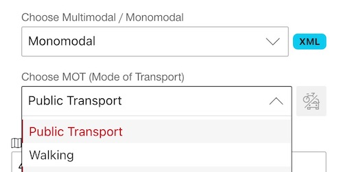
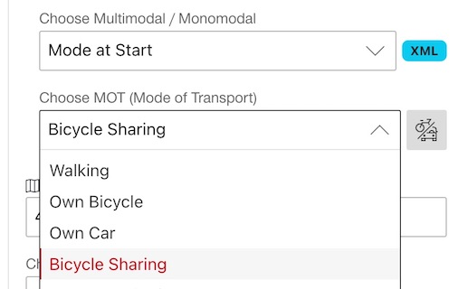
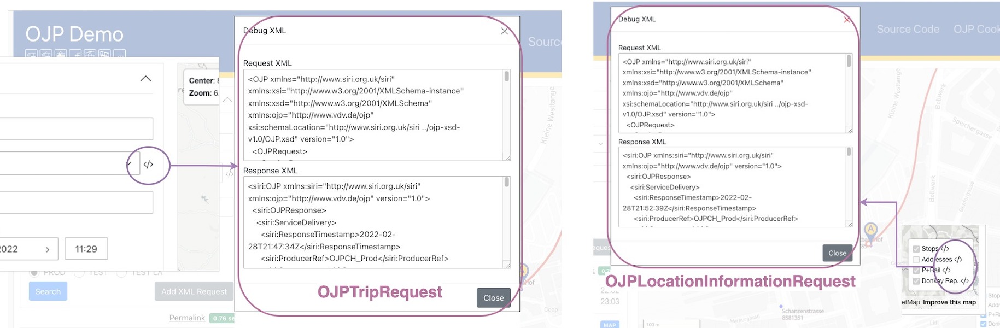
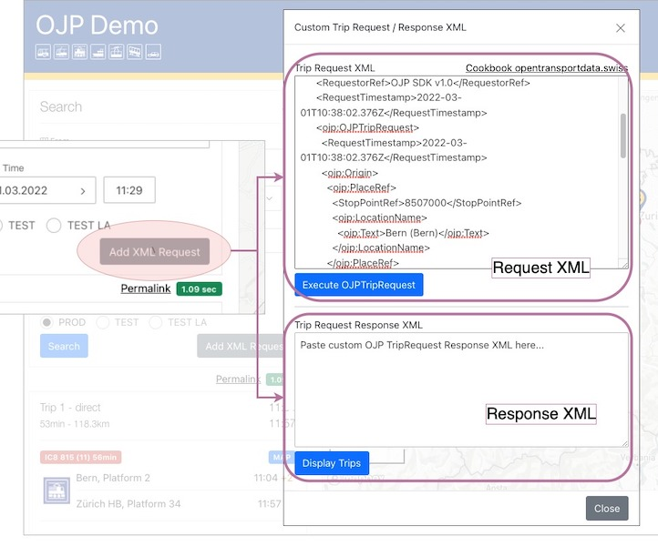

# OJP App Features

## From / To / Via Endpoints

- from/to endpoints can be pick-ed up using the autocomplete (type-ahead) feature

- clicking on the `From`, `To` labels will zoom the map to the endpoint locations

- the `From`/ `To`/ `Via` endpoints can be chosen from the map via right-click action

- the `From`/ `To`/ `Via` position of the map markers can be adjusted via dragging the marker on the map

## Mono-modal Journey

- by default `Public Transport` is used

- for other MOTs (Walking, Own Cycle, etc) the `ItModesToCover` will be changed accordingly, i.e. 
`<ojp:ItModesToCover>walk</ojp:ItModesToCover>` for 

- the response is will contain `ojp:TripResult/ojp:Trip` nodes which are composed of individual, mono-modal `ojp:TripLeg` entries. 

- see [request](./request_examples/Gurten_Zuerich-simple-01-request.xml) and [response](./request_examples/Gurten_Zuerich-simple-02-response.xml) XMLs.

## Multi-modal Journey

- the user can choose custom mode at start, end or both start/end part of the journey.

- i.e. a `Mode at Start` with `Bicyle Sharing` MOT will use custom mode for the first part of the journey and the rest will be done with public transport

## Inspect OJP request/response XML

The OJP [TripRequest](https://opentransportdata.swiss/en/cookbook/ojptriprequest/) and [LocationInformationRequest](https://opentransportdata.swiss/en/cookbook/location-information-service/) request / response can be debugged directly in the application, click on the `</>` icon next to the MOT select or POI map layer.

## Use custom OJP TripRequest XML

The user can upload a custom TripRequest request and response XML.

----

CHANGELOG
- Oct 2022 - updated with mono-, multi- modal journeys
- Feb 2022 - created this document