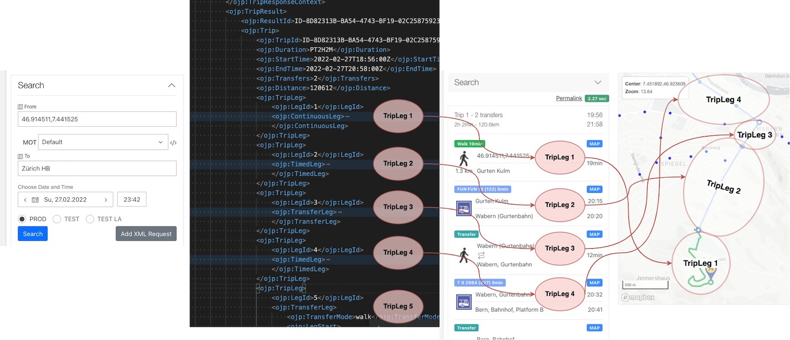
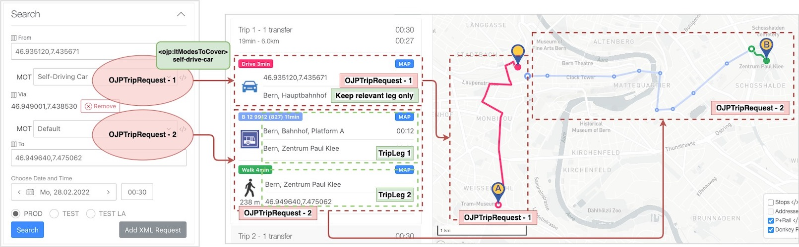

# OJP App Features

## From / To / Via Endpoints

- from/to endpoints can be pick-ed up using the autocomplete (type-ahead) feature

- clicking on the `From`, `To` labels will zoom the map to the endpoint locations

- the `From`/ `To`/ `Via` endpoints can be chosen from the map via right-click action

- the `From`/ `To`/ `Via` position of the map markers can be adjusted via dragging the marker on the map

## Simple Journey

- only the `From` and a `To` endpoint are used.
- there is no `Via`(intermediary) point
- the response is will contain `ojp:TripResult/ojp:Trip` nodes which are composed of individual, mono-modal `ojp:TripLeg` entries. 

- see [request](./request_examples/Gurten_Zuerich-simple-01-request.xml) and [response](./request_examples/Gurten_Zuerich-simple-02-response.xml) XMLs.

## Multi-steps Journey

- along with `From` and `To` we can use one or multiple `Via` points. They can be added for now only via the map (see above)
- the mode of transport between the points can be enforced:
    - `Default` will let OJP to decide the best MOT
    - `Walking` will consider only `ojp:Trip` nodes that have a `ojp:TripLeg` with `walk` mode.
    - `Self-Driving Car`, `Shared Mobility` will consider only `ojp:Trip` nodes that have a `ojp:TripLeg` with `ojp:Service/ojp:IndividualMode = self-drive-car` or `cycle`.

- there are 2 `OJPTripRequest` done after each-other (number of requests = number of via points + 1)
- first request will keep only the `TripLeg` that satisfy the MOT condition
- for the 2nd `OJPTripRequest` the prev request `endDateTime` will be used as a start time.
- the `TripLeg` nodes from the prev requests are prepended to the `TripLeg` nodes of the last `OJPTripRequest`. 
- the final journey stats (duration, start, end datetimes) are updated

----

VIP
- document the debug XML

----

CHANGELOG
- Feb 2022 - created this document