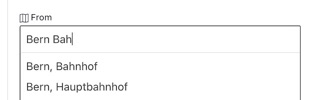
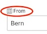
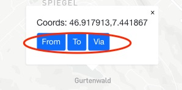

# OJP App Features

## From / To / Via Search

- from/to endpoints can be pick-ed up using the autocomplete (type-ahead) feature

- clicking on the `From`, `To` labels will zoom the map to the endpoint locations

- the `From`/ `To`/ `Via` endpoints can be chosen from the map via right-click action

- the `From`/ `To`/ `Via` position of the map markers can be adjusted via dragging the marker on the map

----

VIP

----

CHANGELOG
- Feb 2022 - created this document